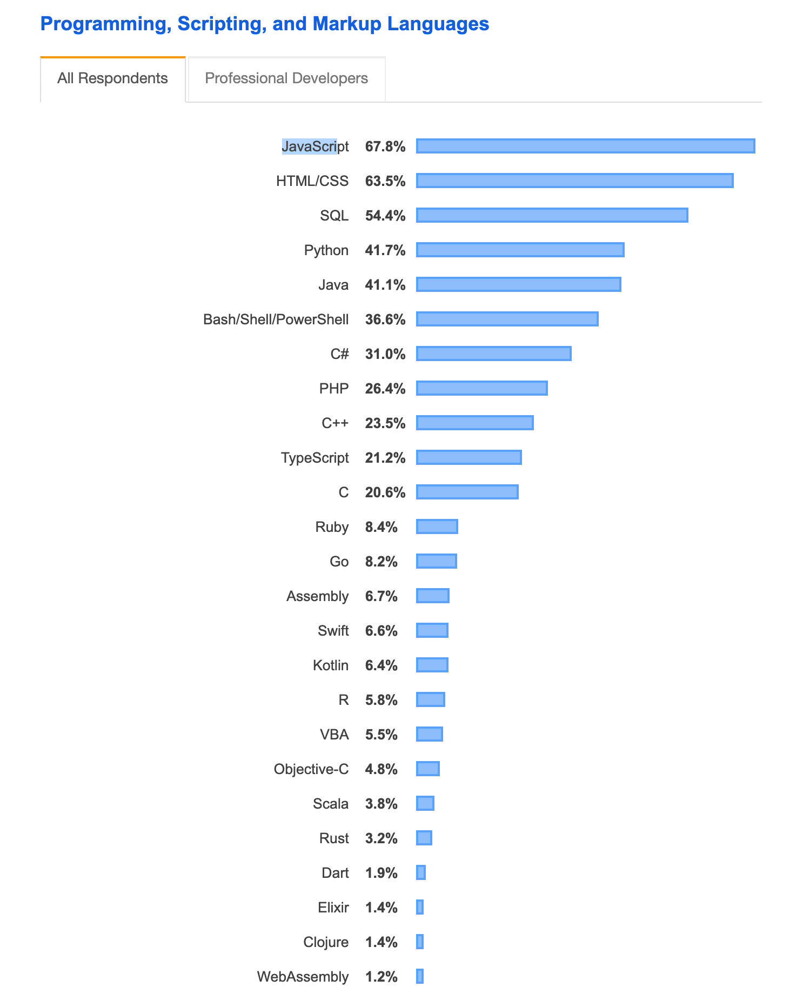
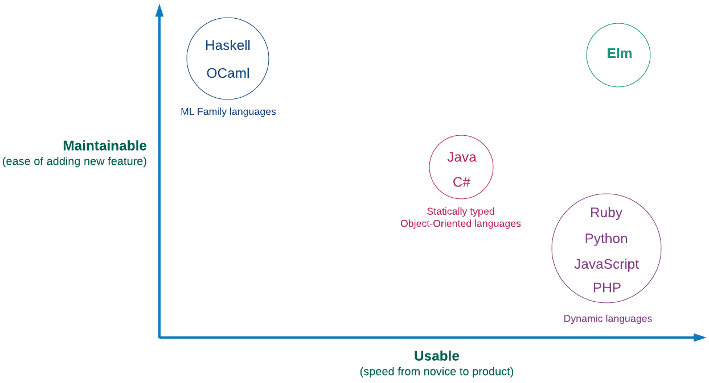

# Почему Elm?


"Мы хотим делать нашу работу хорошо, и мы хотим чтобы она имела смысл. И, при прочих равных, мы предпочитаем получать удовольствие по пути." - [_Sandi Metz_](https://www.amazon.com/Practical-Object-Oriented-Design-Ruby-Addison-Wesley-ebook/dp/B0096BYG7C/)


Как программисты, мы гордимся тем, что создаем просто в использовании и надежные программы для решения самых сложных проблем с которыми сталкиваются наши пользователи. Однако сложно, создавать хорошее приложения, которое не только решает современные проблемы, но и легко будет поддерживаться будущем. Действительно сложно. Это не связано с отсутствием инструментов, которые позволяют нам поставлять приложения с высокой степенью обслуживания. Для примера есть языки программирования входящие в семейство [ML](https://ru.wikipedia.org/wiki/ML), такие как [Haskell](https://ru.wikipedia.org/wiki/Haskell) и [OCaml](https://ru.wikipedia.org/wiki/OCaml) в которых практически невозможно поймать ошибки в продакшене. Компиляторы для этих языков отлавливают почти все ошибки, которые могут возникнуть в рантайме, в отличии от других не столь строгих языков.

В таком случае всем программистам стоит использовать языки из семейства ML. В конце концов, кто хочет создавать программы с ошибками? В реальности все обстоит наоборот. Давайте посмотрим на результаты опроса проведенного Stack Overflow в 2019 году для самых популярных языков программирования. 


[Результаты опроса разработчиков 2019](https://insights.stackoverflow.com/survey/2019)


Всего несколько языков относящиеся семейству ML, но не один не применяется к Front-end. Программисты очень умны. Почему же тогда они используют такие языки, как JavaScript, которые не имеют встроенных средств защиты для предотвращения ошибок в рантайме?

Одной из причин может быть то, что языки из семейства ML больше предназначены для создания Back-end. Front-end программисты отвечают за код, который запускается на клиента\(обычно браузер\), а не на сервере. Браузеры понимают только Javascript, это не дает возможности использовать другие языки программирования. Тем не менее, было предпринято множество попыток обеспечить надежность от языков семейства ML к клиентской разработке с помощью таких проектов, как [Fay](https://github.com/faylang/fay) и [GHCJS](https://github.com/ghcjs/ghcjs), которые компилируются в JavaScript, понятный браузеру. Все же Front-end программисты кажется не хотят их использовать.

Другая причина может заключаться в том, что языки из семейства ML трудно использовать. Они печально известны высоким порогом входа. Для сравнения, любой кто имеет опыт с HTML и CSS может научиться как добавить функционал Javascript на страницу в течении часа. Javascript легок на старте, что делает его очень эффективным в использовании. Тем не менее, большие приложения написанные на нем могут стать кошмаром для поддержания. Программисты, как правило, пишут множество тестов, чтобы приложение написанное на Javascript надежнее работало в продакшене. Они также используют сложные архитектурные шаблоны, чтобы сделать добавление нового функционала в свое приложение менее болезненным. Нам нужен язык, который не только обеспечивает надежность, присущую языкам из семейства ML, но и очень удобен, как JavaScript. Elm - один из таких языков.


[Источник: Ориентированный на пользователя дизайн в Elm](https://www.youtube.com/watch?v=oYk8CKH7OhE)


Elm - функциональный язык программирования для создания клиентских приложений. Он взял лучшее из обоих миров, создания очень надежных приложений одновременно с легкостью. Помимо легкого в поддержании и удобного использования, Elm предоставляет множество преимуществ, который нет в большинстве основных языков, такие как иммутабельность\(неизменяемые значения\), стейтлес функции\(не хранящие состояние внутри\), вывод типов, сопоставление с образцом, автоматическое форматирование кода и отличный отладчик.

В заключении, Elm предоставляет оригинальную архитектуру для организации кода, что делает управление потоком данных между различными компонентами на одном дыхании. Большинство языков программирования не имеют похожего способа организации кода подобного этому. Нам часто приходится сравнивать и сопоставлять несколько структур, что сбивает с толку и отнимает много времени. Elm принимает это решение за нас, чтобы мы могли сосредоточиться на решении текущей проблемы и не беспокоиться о том, насколько легко будет изменить наше приложение в будущем. Мы подробно разберем архитектуру Elm в главе 5.

