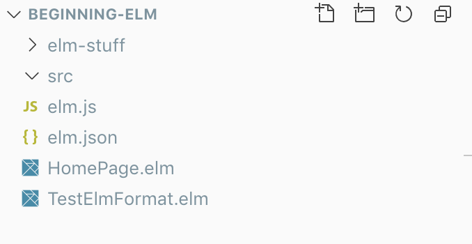

# Создание простой веб-страницы

Давайте немного попробуем Elm, прежде чем познакомиться с ним поближе. Мы создадим простую веб страницу используя HTML и CSS. Позже мы переделаем эту страницу, но уже используя Elm, чтобы увидеть разницу между двумя подходами.

### Создание простой страницы с HTML

Создайте файл с названием `homepage.html` внутри раздела `beginning-elm` которую мы создали на странице установки и добавьте следующий код.

```markup
<!DOCTYPE html>
<html>
  <head>
    <link rel="stylesheet" href="https://maxcdn.bootstrapcdn.com/bootstrap/3.3.7/css/bootstrap.min.css">

    <style>
      .jumbotron {
        background-color: #e6ffe6;
        text-align: center;
      }
    </style>
  </head>

  <body>
    <div class="jumbotron">
      <h1>Welcome to Dunder Mifflin!</h1>
      <p>
        Dunder Mifflin Inc. (stock symbol <strong>DMI</strong>) is
        a micro-cap regional paper and office supply distributor with
        an emphasis on servicing small-business clients.
      </p>
    </div>
  </body>
</html>
```

Это простая веб-страница с приветственным сообщением и коротким описаний одной из наших любимых компаний. Страница стилизована с помощью фреймворка [Bootstrap](https://getbootstrap.com). Она также содержит написанные нами стили.


Не беспокойтесь, если вы не знакомы с Bootstrap. Мы используем его, чтобы страница выглядела немного лучше. Позже это послужит примером того, как загрузить внешний CSS в Elm.


Откройте `homepage.html` в браузере. Она должна выглядеть примерно так:


Дальше мы создадим эту страницу с помощью Elm.

### Создание простой страницы с Elm

Создайте новый файл под названием `HomePage.elm` в разделе `beginning-elm` и добавьте следующий код.

```haskell
module Main exposing (..)

import Html exposing (..)
import Html.Attributes exposing (..)


view model =
    div [ class "jumbotron" ]
        [ h1 [] [ text "Welcome to Dunder Mifflin!" ]
        , p []
            [ text "Dunder Mifflin Inc. (stock symbol "
            , strong [] [ text "DMI" ]
            , text ") is a micro-cap regional paper and office supply distributor with an emphasis on servicing small-business clients."
            ]
        ]


main =
    view "dummy model"
```

Не беспокойтесь о понимании кода сейчас. Мы разберем как работает Elm приложение немного позже. Весь этот код имплементирует ту же страницу созданную с помощью HTML и CSS. Запустите следующие команды с разделе `beginning-elm` в терминале.

```bash
$ elm init
```

Это команда создает `elm.json` файл на основе которого запускаются все Elm команды, позже будет показано для чего он. Команда спросит у вас подтверждения, выбирайте `Y` 

```bash
Hello! Elm projects always start with an elm.json file. I can create them!

Now you may be wondering, what will be in this file? How do I add Elm files to
my project? How do I see it in the browser? How will my code grow? Do I need
more directories? What about tests? Etc.

Check out <https://elm-lang.org/0.19.0/init> for all the answers!

Knowing all that, would you like me to create an elm.json file now? [Y/n]:
```

Дальше добавится сообщение `Okay, I created it. Now read that link!` и можно продолжать дальше.


Если у вас возникли трудности с запуском команды или при запуске все зависает, то ответы вы сможете найти в разделе F.A.Q.


Теперь можем выполнить команду для компиляции Elm в Javascript.

```bash
$ elm make HomePage.elm --output elm.js
```


Выходной файл не обязательно должен называться elm.js. Вы можете назвать его как угодно. Если вы назовете его как-то по другому, то обязательно измените название в HTML ниже.


Эта команда должна вывести подобный ответ.

```bash
Dependencies loaded from local cache.
Dependencies ready!
Success! Compiled 1 module.
```

И создать несколько файлов и директорий.



1. **elm.json** - Elm использует этот файл для хранения метаданных о проекте и зависимостях\(создала команда `elm init` \).
2. **elm-stuff** - Здесь Elm хранит артефакты, созданные после того, как `elm make` скомпилирует наш код, включая пакеты, от которых зависит наш проект.
3. **elm.js** - JavaScript файл содержащий  скомпилированный код.

Создайте еще один html файл под название `index.html` внутри директории `beginning-elm` и добавьте следующий код.

```markup
<!DOCTYPE html>
<html>

<head>
  <link rel="stylesheet" href="https://maxcdn.bootstrapcdn.com/bootstrap/3.3.7/css/bootstrap.min.css">

  <style>
    .jumbotron {
      background-color: #e6ffe6;
      text-align: center;
    }
  </style>
</head>

<body>
  <div id="elm-code-is-loaded-here"></div>

  <script src="elm.js"></script>
  <script>
    Elm.Main.init({
      node: document.getElementById("elm-code-is-loaded-here")
    });
  </script>
</body>

</html>
```

Код внутри `<head>` абсолютно такой же. `<body>` выглядит немного иначе. Мы создали `div` и присвоили ему `id` . Затем мы загружаем файл elm.js, который был скомпилирован командой `elm make HomePage.elm --output elm.js` . Эта команда скомпилировал Elm код в Javascript и вернула файл elm.js. В самом конце мы вызываем функцию `Elm.Main.init` передавая ей объект с ключом `node` в котором значение это элемент с `id` в которое загружается Elm приложение.


Не беспокойтесь, если что-то из этого еще не понятно. Мы расскажем о механике создания и встраивания приложения Elm позже.


Откройте `index.html` в браузере. Страница должна выглядеть также как и созданная ранее с помощью только HTML и CSS.

Создание простой веб-страницы с помощью Elm заняло немного больше усилий, чем просто HTML и CSS. Если все, что вам нужно, это создание статических страниц, то вероятно Elm не подходит для этого. Но если вам нужно создать интерактивное веб-приложение, которое со временем будет увеличиваться в размерах и сложности, то Elm - фантастический инструмент для этого.

Остальная часть этой книги посвящена знакомству с Elm и пониманию того, как его архитектура помогает нам создавать невероятно надежные клиентские веб-приложения.

